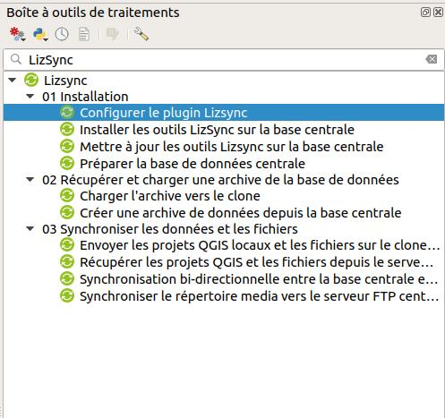

# Installation et utilisation de LizSync sur QGIS

## Introduction

Ce document présente l'outil LizSync qui permet de mettre en oeuvre la synchronisation entre une base de données PostgreSQL centrale et une ou plusieurs bases de données clone.

LizSync permet le **déploiement et la synchronisation des données** entre une unique base de données centrale et un ou plusieurs clones:

* base de données **centrale**: c'est la base de production qui contient l'ensemble des données.
* base de données **clone**: c'est une base installée sur un ordinateur, une tablette ou un autre serveur. Elle contient un sous-ensemble des schémas de la base centrale

Une **extension LizSync pour QGIS** permet de lancer les différentes actions nécessaires pour faire fonctionner cet outil: installation, préparation de la base centrale, création et déploiement d'archive, synchronisation.

## Scénario et concepts

### Données en base PostgreSQL

Une base **PostgreSQL** appelée centrale contient un ensemble complet de données, organisées dans des **schémas**. Aucune donnée n'est stockée dans le schéma **public**.

Avant de pouvoir utiliser **LizSync**, on doit d'abord l'**installer sur la base centrale**, afin d'ajouter les schémas, tables et fonctions qui permettent de gérer la synchronisation. Toutes les données relatives aux synchronisations seront stockées dans le schéma `lizsync`. Les tables du schéma `audit` enregistreront les modifications réalisées sur les données des autres schémas.

Ensuite, il faut **préparer cette base centrale**, c'est-à-dire s'assurer que les tables à synchroniser comportent les champs requis, notamment un **identifiant unique** (UUID), et que les modifications sur ces tables sont bien enregistrées au fil de l'eau via l'outil d'audit de LizSync.

Lorsque la base centrale est prête, il est alors possible de **créer une archive de données** pour un ou plusieurs schémas. Cette archive contient les données des schémas, mais aussi les métadonnées utiles de la base centrale (identifiant unique). La création de l'archive est vue pour LizSync comme une action de **synchronisation**, dite complète.

Cette archive est ensuite **chargée vers la base clone** (vers un ou plusieurs clones), ce qui supprime l'ensemble des données du clone pour les schémas de l'archive, puis réinstalle les outils LizSync sur le clone et enfin charge les données. A l'issu de cette phase, les données du clone pour les schémas choisis sont équivalentes aux données qui étaient présentes lors de la création de l'archive.

Les données des bases centrales et clone peuvent alors **évoluer librement** en parallèle, tant que la **structure n'est pas modifiée** (pas d'ajout de tables ou de champs). Par exemple via une saisie de données terrain avec des tablettes sur les bases clones.

Une **synchronisation bidirectionnelle** peut alors être effectuée pour récupérer sur le clone les changements apparus sur la base centrale, puis envoyer sur la base centrale les modifications des données du clone.

### Cartes Lizmap dans le contexte GeoPoppy

Pour pouvoir **éditer les données** dans les bases PostgreSQL, il est possible d'utiliser n'importe quel logiciel: QGIS, QField, PgAdmin, des scripts SQL lancés manuellement, etc.

L'outil **Lizmap Web Client** peut aussi être utilisé pour réaliser ces éditions:

* sur la **base centrale**, avec l'application Lizmap accessible en ligne
* sur les **bases clone** embarquées sur des tablettes, via l'outil **GeoPoppy pour Android**, qui permet d'embarquer l'application **Lizmap en mode déconnecté**.

Dans ce contexte **GeoPoppy**, il faut donc que les projets QGIS `*.qgs` et les configurations Lizmap `*.qgs.cfg` soient:

* **récupérés** depuis le serveur central, par exemple via FTP
* **adaptés** pour utiliser les données de la base PostgreSQL **clone** de la tablette, en modifiant les informations de connexion
* **chargés sur le clone (tablette)** pour être consultés via Lizmap

L'extension **LizSync** pour QGIS propose des algorithmes qui facilient le transfert des projets QGIS depuis le serveur FTP central vers les clones.

## Installation et configuration dans QGIS

Dans QGIS, il faut:

* installer le plugin LizSync
* configurer les connexions PostgreSQL vers la **base centrale** et les **bases clone**

### Installation de l'extension LizSync pour QGIS

L'extension **LizSync** peut être installé dans QGIS avec le **gestionnaire d'extension**. Tant que l'extension n'est pas incluse dans les dépôts officiels de QGIS, elle peut être récupérée en ajoutant manuellement le dépôt d'extension:

* ouvrir le **Gestionnaire d'extension** via le menu **Extension** de QGIS.
* dans l'onglet **Paramètres**, dans le groupe **Dépôts d'extensions**, cliquer sur le bouton **Ajouter**, puis renseigner les champs suivants
    - **Nom**: 3liz extension LizSync Github
    - **URL**: https://github.com/3liz/qgis-lizsync-plugin/releases/latest/download/plugins.xml
    - **Authentification**: laisser vide
    - **Compatible**: laissé coché
* **Valider**, puis cliquer sur le bouton **Recharger tous les dépôts**

Ensuite, chercher l'extension dans la liste via l'onglet **Tout** en tapant `lizsync` dans le champ **Rechercher**, puis l'installer.

### Les algorithmes du plugin LizSync

L'extension **LizSync** a ajouté des **algorithmes** dans le **menu Traitement** de QGIS, qui permettent de suivre les différentes étapes précisées dans le scénario d'utilisation. Pour voir la liste des algorithmes disponibles, il faut ouvrir le panneau **Boîte à outils de traitements** à partir du menu **Traitement** de QGIS, puis chercher **LizSync**

Chaque algorithme joue un rôle dans le scénario classique d'utilisation.

### Configurer les accès PostgreSQL dans QGIS

Avant de pouvoir utiliser l'extension **LizSync**, vous devez configurer les connexions PostgreSQL à la base de données centrale, et à la base de données clone.

Pour cela, utiliser le menu **Couches / Ajouter une couche vecteur / Ajouter une couche PostGIS** et cliquer sur le bouton **Nouveau** situé sous la liste déroulante. Renseignez-bien:

* le **nom** est libre. Veillez bien à utiliser un nom qui caractérise de manière unique la base de données. Par exemple **Base centrale**, **Clone A** ou **Tablette XYZ**
* le **service** : il doit être laissé vide si vous souhaitez renseigner les champs suivants (hôte, port, etc.). Si vous indiquez un nom, il doit correspondre à un service valide. Voir la documentation de QGIS: https://docs.qgis.org/3.10/fr/docs/user_manual/managing_data_source/opening_data.html#postgresql-service-connection-file
* l'**hôte**: renseigner l'adresse IP du serveur
* le **port**: donner le port, par défaut 5432
* la **base de données**: préciser le nom de la base de données
* Authentification de base
    - **Nom d'utilisateur**: l'utilisateur qui peut se connecter. Cocher la case **Stocker**
    - **Mot de passe**: son mot de passe. Cocher la case **Stocker**
* Cliquer sur le bouton **Tester la connexion**
* Cocher la case **Utiliser la table de métadonnées estimées**

Dans la suite de ce document, nous appellerons **centrale** et **clone a** les deux bases de données configurées.

### Base clone sur le GeoPoppy

Lorsque le clone est une **tablette Android** sur laquelle est installé l'outil **GeoPoppy** (via le logiciel UserLand), vous devez au préalable:

* **connecter la tablette en WIFI** sur le même réseau que votre ordinateur
* lancer la **session GeoPoppy** via le logiciel UserLand
* Renseigner le **mot de passe** `geopoppy`
* Les services sont lancés, et à la fin un message fourni l'**adresse IP de la tablette**.

Dans votre logiciel QGIS, vous pouvez maintenant créer une connexion PostgreSQL, avec les informations suivantes:

* **Nom**: libre, par exemple **Tablette GeoPoppy**
* **hôte**: l'IP de la tablette sur le réseau WIFI, affichée dans la session. Par example `192.168.1.7`
* **base de données**: `geopoppy`
* **utilisateur**: `geopoppy`
* **mot de passe**: `geopoppy`

Vous pouvez **tester** que la connexion fonctionne bien, par exemple avec le **gestionnaire de bases de données** de QGIS: menu `Base de données / Gestionnaire de base de données`.

## Synchronisation des données PostgreSQL

### Rappel des étapes clés de mise-en-oeuvre

Une **base de données centrale** contient les données. On souhaite exporter certaines de ces données dans des **bases clone**, modifier les données, puis synchroniser les modifications entre les bases. Les étapes sont les suivantes:

* les **outils LizSync sont isntallés** sur la base de données centrale
* **la base centrale est préparée**: ajout des métadonnées lizsync, des champs uid sur les tables, des triggers d'audits, etc.
* une **archive ZIP est créée** à partir des données de la base centrale
* **l'archive est chargée** sur un ou plusieurs **clones**, ce qui est considéré comme une **synchronisation complète**.
* **les données sont modifiées** sur la base centrale et les clones: ajout, suppression, modification
* **une synchronisation bidirectionnelle** est lancée depuis chaque clone lorsque les clones sont connectés à internet

### Choix techniques de LizSync

Certains choix **méthodologiques et techniques** ont été faits pour assurer la synchronisation bidirectionnelle.

* la base centrale stocke dans les schéma `lizsync` et `audit` les données nécessaires aux synchronisations.
* les données du schéma `public` ne sont **jamais synchronisées**
* les tables doivent avoir une **clé primaire de type entier, autoincrémentée**. Cet identifiant pourrait diverger entre la base centrale et les clones. Il n'est utile que localement pour certaines applications (QGIS préfère qu'il y ait une clé primaire entière)
* les tables doivent toutes posséder un champ **uid** de type **uuid** (valeur exemple: `5d3d503c-6d97-f11e-a2a4-5db030060f6d`) avec une valeur par défaut automatique. Ce champ est le pivot de la synchronisation. Il permet de reconnaître de manière unique un objet entre toutes les bases de données.
* les références de **clés étrangères** doivent se baser sur le champ **uid** de la table parente, et non sur la clé primaire, car les clés primaires peuvent diverger entre bases.
* lors de la synchronisation bidirectionnelle, les modifications de la base centrale sont récupérées, puis comparées à celles du clone pour gérer les conflits d'édition. Elles sont ensuite rejouées sur le clone et la base centrale.
* les modifications de données sont rejouées seulement pour les champs modifiés.

### Utilisation de l'extension LizSync pour la synchronisation PostgreSQL

#### Installer les outils LizSync sur la base centrale

Cet algorithme va créer **2 nouveaux schémas** `lizsync` et `audit` sur la base de données centrale:

* Un schéma **audit** avec les fonctions et tables d'audit, c'est-à-dire de suivi des modifications dans les tables (ajout, modification et suppression de données)
* Un schéma **lizsync** avec les tables et fonctions nécessaires pour faire fonctionner la synchronisation.

Attention ! Si vous cochez la case **écraser**, vous perdrez toutes les données existantes dans le schéma audit et/ou le schéma lizsync !

#### Préparer la base centrale

Prépare la base de données PostgreSQL du serveur central avec les informations nécessaires pour l'outil LizSync.

LizSync a besoin :

* d'un **ID de serveur** stocké dans la table `lizsync.server_metadata`
* Toutes les tables des schémas choisis doivent avoir une **colonne d'identifiant unique** (uid) contenant un UUID
* Toutes les tables des schémas choisis doivent être **suivies par les triggers d'audit**

Vous pouvez fournir une **liste de schémas** PostgreSQL de la base centrale, cet algorithme ajoutera les éléments nécessaires si besoin.

#### Créer une archive de données depuis la base centrale

Récupère des données depuis la base de données centrale, pour un futur chargement sur un ou plusieurs clone(s).

Ce script sauvegarde **toutes les données de la liste de schémas** spécifiée vers une **archive ZIP**, nommée par défaut `central_database_package.zip`.

Vous pouvez ajouter un **fichier SQL optionnel** qui sera lancé sur le clone après chargement des données de l'archive. Ce fichier doit contenir des **requêtes PostgreSQL valides**, et peut être utilisé pour:

* ajouter des fonctions PostgreSQL utiles
* supprimer certains triggers
* enlever certaines contraintes sur les champs

L'idée est d'adapter le contenu de la base à l'usage local sur le clone.

Une **connexion internet vers la base centrale est nécessaire** pour pouvoir créer un item d'historique de synchronisation sur la base centrale dans la table `lizsync.history`, et naturellement pour pouvoir télécharger les données de la base de données centrale.

#### Charger l'archive vers le clone

Charger une **archive ZIP**, générée précédemment via l'algorithme `Créer une archive de données depuis la base centrale`, vers le clone choisi. Cette archive ZIP, nommée par défaut `central_database_package.zip`, contient les données sauvegardées depuis la base **PostgreSQL centrale**.

**A la fin de cette étape, les données sont prêtes à être modifiées sur le clone et sur la base centrale.**

#### Synchronisation bi-directionnelle

Ce script lance une **synchronisation bi-directionnelle** entre la base de données centrale et le clone.

Les données à synchroniser sont récupérées en lisant le contenu de la table `audit.logged_actions` de chaque base de données, depuis la **dernière synchronisation** ou le **dernier chargement d'une archive ZIP** (synchronisation complète).

Les logs de modification des données sont transformés en commandes SQL `INSERT`, `UPDATE`, `DELETE` qui sont jouées sur les bases de données dans cet ordre:

* Depuis le serveur central vers le clone
* Depuis le clone vers le serveur central

Pour les `UPDATE`, les logs sont comparés pour gérer les conflits, c'est-à-dire les modifications effectuées sur une **même table, un même objet et sur un même champ**. La modification réalisée la dernière (date de modification sur la base) est conservée, la plus ancienne est rejetée.

La base de données centrale stocke quels sont les clones qui ont rejoués les logs de modification, et garde un **historique des synchronisations**. Les conflits sont listés dans la table `lizsync.conflicts` de la **base centrale**.

## Synchronisation des projets QGIS et des fichiers

L'application Lizmap du GeoPoppy a besoin de **projets QGIS** configurés avec le plugin **Lizmap**. Ces projets QGIS peuvent être des projets existants, mais doivent être **adaptés au contexte du GeoPoppy**, notamment les informations de connexion PostgreSQL, pour que les données utilisées soient les **données locales du GeoPoppy** (base clone) et non les données sur la base centrale.

Cela permet ainsi de partir avec la tablette en mode déconnecté (sans connection internet). Les données visualisées et modifiées sont stockées **dans la base de données PostgreSQL de la tablette** (clone), et pourront être synchronisées une fois la connexion internet retrouvée.

### Récupérer les projets QGIS et les fichiers depuis le serveur central

Cet algorithme permet de réaliser la **récupération des projets QGIS, des configurations Lizmap et des fichiers** depuis un **serveur FTP central**. Ce serveur FTP est souvent déjà utilisé pour publier des projets QGIS sur l'application Lizmap du serveur central.

Tous les fichiers non présents dans le répertoire de destination sont automatiquement récupérés. Les fichiers qui n'ont pas été modifiés ne sont pas téléchargés, pour éviter un temps trop long de téléchargement.

Si la dernière case est cochée, les informations de connexion à la base de données centrale seront **remplacées par celles du Geopoppy**: hôte, port, base de données, utilisateur et mot de passe.

Les projets pourront donc ensuite être **envoyés sur le clone** pour être consultés en mode déconnecté, puisqu'ils appellent les données locale du clone, et non de la base centrale.

### Envoyer les projets QGIS locaux et les fichiers sur le clone

Une fois les projets récupérés depuis le serveur FTP central, et adaptés pour le GeoPoppy, il faut les **envoyer sur le clone** (la tablette). Pour cela, vous pouvez utiliser **2 méthodes**:

* Par transfert via cable USB
* Avec l'algorithme `Envoyer les projets QGIS locaux et les fichiers sur le clone via FTP`

#### Transfert par cable USB

Une fois la tablette branchée par **cable USB** à votre ordinateur, le message suivant doit s'afficher: **Autoriser accès aux données de la tablette ?** *L'appareil connecté va pouvoir accéder aux données se trouvant sur cette tablette*:

* Cliquer sur le bouton **Autoriser**,
* Ouvrir votre explorateur de fichiers sur votre ordinateur
* Trouver le point de montage correspondant à la tablette, et naviguer dans le répertoire `Android/data/tech.ula/files/storage/geopoppy/qgis/`

Vous pouvez ensuite copier/colller les projets QGIS et les fichiers récupérés auparavant dans le répertoire `Android/data/tech.ula/files/storage/geopoppy/qgis/`.

Veillez à bien avoir auparavant supprimé les fichiers inutiles pour votre session terrain, et **adapté les projets QGIS** à la connexion locale de la base clone de la tablette.

La méthode par **connexion USB** sera probablement la plus rapide, notamment si vous devez envoyer des **fichiers volumineux** (orthophotos par exemple).

#### Avec l'algorithme "Envoyer les projets QGIS locaux et les fichiers sur le clone via FTP"

Cet algorithme supprimera les projets QGIS et les configurations Lizmap présentes sur la tablette, puis lancera la synchronisation des données.

**Une fois les projets QGIS et les configurations Lizmap envoyés, vous pouvez utiliser l'application Lizmap installée sur la tablette pour ouvrir la carte et utiliser les fonctionnalités de visualisation et d'édition de données.**
