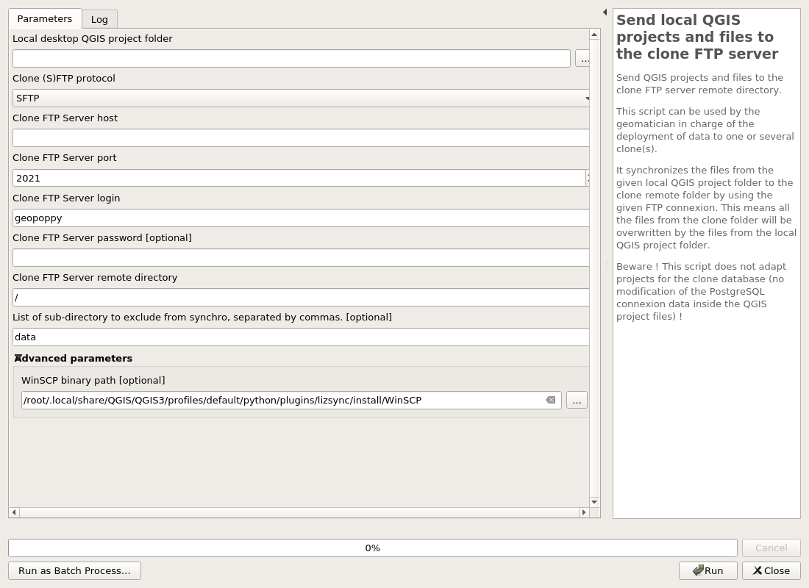
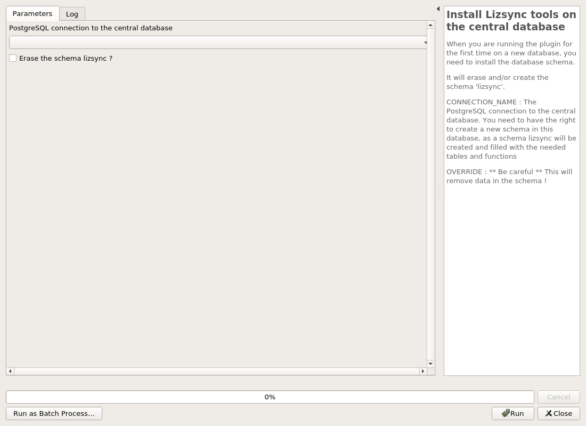
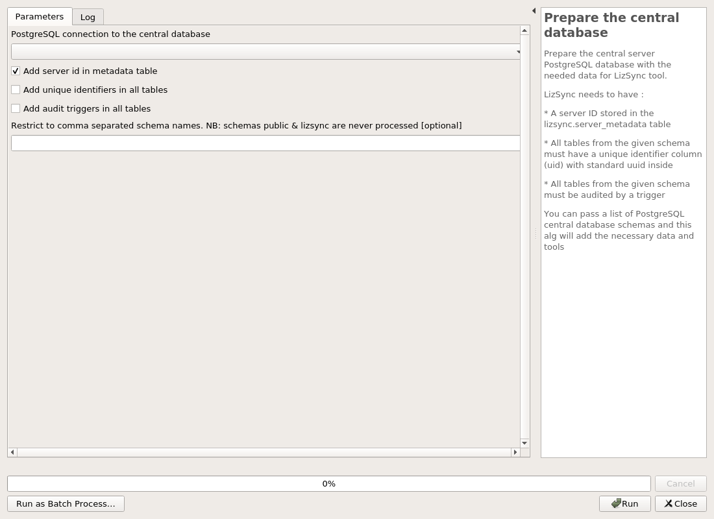
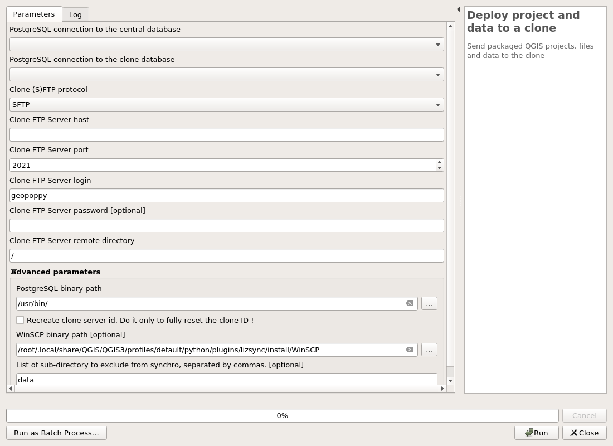

---
hide:
  - navigation
---

# Processing

## 03 File synchronization

### Build a mobile QGIS project

 This scripts builds a mobile version of the current QGIS project. It only changes the qgs file, it is not in charge to export the layers.

 The following actions are executed:
 * search and replace the connection parameters for the PostgreSQL layers needed to be edited in the clone database
 * search and replace the datasource for the layers which are exported to Geopackage
 * save the changes in a new QGIS project file name after the current project name with the addition of the suffix _mobile. For example: YOUR_PROJECT_mobile.qgs if your project is named YOUR_PROJECT.qgs

#### Parameters

| ID | Description | Type | Info | Required | Advanced | Option |
|:-:|:-:|:-:|:-:|:-:|:-:|:-:|
CONNECTION_NAME_CENTRAL|PostgreSQL connection to the central database|String|The PostgreSQL connection to the central database. Needed to be able to search & replace the database connection parameters in the QGIS project to make it usable in the clone (Termux or Geopoppy).|✓|||
PG_LAYERS|PostgreSQL Layers to edit in the field|MultipleLayers|Select the PostgreSQL layers you want to edit in the clone. The connection parameters of these layers will be adapted for the clone PostgreSQL datatabase|✓|||
GPKG_LAYERS|Layers to convert into Geopackage|MultipleLayers|Select the vector layers you have exported (or you will export) to a Geopackage file  The datasource of these layers will be changed to reference the Geopackage layer instead of the initial source|✓|||

#### Outputs

| ID | Description | Type | Info |
|:-:|:-:|:-:|:-:|
OUTPUT_STATUS|Output status|Number||
OUTPUT_STRING|Output message|String||

***

### Send local QGIS projects and files to the clone FTP server

 Send QGIS projects and files to the clone FTP server remote directory.

 This script can be used by the geomatician in charge of the deployment of data to one or several clone(s).

 It synchronizes the files from the given local QGIS project folder to the clone remote folder by using the given FTP connexion. This means all the files from the clone folder will be overwritten by the files from the local QGIS project folder.

 Beware ! This script does not adapt projects for the clone database (no modification of the PostgreSQL connexion data inside the QGIS project files) !

#### Parameters

| ID | Description | Type | Info | Required | Advanced | Option |
|:-:|:-:|:-:|:-:|:-:|:-:|:-:|
LOCAL_QGIS_PROJECT_FOLDER|Local desktop QGIS project folder|File||✓|||
WINSCP_BINARY_PATH|WinSCP binary path|File|||✓|Default: /root/.local/share/QGIS/QGIS3/profiles/default/python/plugins/lizsync/install/WinSCP   |
CLONE_FTP_PROTOCOL|Clone (S)FTP protocol|Enum||✓||Values: SFTP, FTP  |
CLONE_FTP_HOST|Clone FTP Server host|String||✓|||
CLONE_FTP_PORT|Clone FTP Server port|Number||✓||Default: 2021   Type: Integer  Min: -1.7976931348623157e+308, Max: 1.7976931348623157e+308  |
CLONE_FTP_LOGIN|Clone FTP Server login|String||✓||Default: geopoppy   |
CLONE_FTP_PASSWORD|Clone FTP Server password|String|||||
CLONE_FTP_REMOTE_DIR|Clone FTP Server remote directory|String||✓||Default: /   |
FTP_EXCLUDE_REMOTE_SUBDIRS|List of sub-directory to exclude from synchro, separated by commas.|String||||Default: data   |

#### Outputs

| ID | Description | Type | Info |
|:-:|:-:|:-:|:-:|
OUTPUT_STATUS|Output status|Number||
OUTPUT_STRING|Output message|String||

***

## 01 Installation

### Install Lizsync tools on the central database

 Install the LizSync schema with tables and function on the central database.

 This script will add
 * A lizsync schema with tables and functions

Beware ! If the schema lizsync already exists in the database, not installation will be made. You will need to manually correct the situation (drop or modifiy the schemas, tables and functions) with SQL commands.

#### Parameters

| ID | Description | Type | Info | Required | Advanced | Option |
|:-:|:-:|:-:|:-:|:-:|:-:|:-:|
CONNECTION_NAME|PostgreSQL connection to the central database|String|The PostgreSQL connection to the central database. You need to have the right to create a new schema in this database, as a schema lizsync will be created and filled with the needed tables and functions|✓|||
OVERRIDE_LIZSYNC|Drop lizsync schema and all data ?|Boolean||✓|||

#### Outputs

| ID | Description | Type | Info |
|:-:|:-:|:-:|:-:|
OUTPUT_STATUS|Output status|Number||
OUTPUT_STRING|Output message|String||

***

### Prepare the central database

 Prepare the central server PostgreSQL database with the needed data for LizSync tool.

 LizSync needs to have :
 * A server ID stored in the lizsync.server_metadata table
 * All tables from the given schema must have a unique identifier column (uid) with standard uuid inside
 * All tables from the given schema must be audited by a trigger

 You can pass a list of PostgreSQL central database schemas and this alg will add the necessary data and tools

#### Parameters

| ID | Description | Type | Info | Required | Advanced | Option |
|:-:|:-:|:-:|:-:|:-:|:-:|:-:|
CONNECTION_NAME_CENTRAL|PostgreSQL connection to the central database|String|The PostgreSQL connection to the central database.|✓|||
ADD_SERVER_ID|Add server id in metadata table|Boolean||✓||Default: True   |
ADD_UID_COLUMNS|Add unique identifiers in all tables|Boolean||✓|||
ADD_AUDIT_TRIGGERS|Add audit triggers in all tables|Boolean||✓|||
SCHEMAS|Restrict to comma separated schema names. NB: schemas public & lizsync are never processed|String|||||

#### Outputs

| ID | Description | Type | Info |
|:-:|:-:|:-:|:-:|
OUTPUT_STATUS|Output status|Number||
OUTPUT_STRING|Output message|String||

***

### Upgrade LizSync tools in the central database

 Upgrade the Lizsync tables and functions in the central database.

 If you have upgraded your QGIS LizSync plugin, you can run this script to upgrade your central database to the new plugin version.

#### Parameters

| ID | Description | Type | Info | Required | Advanced | Option |
|:-:|:-:|:-:|:-:|:-:|:-:|:-:|
CONNECTION_NAME|PostgreSQL connection to the central database|String|The PostgreSQL connection to the central database. You need to have the right to create a new schema in this database, as a schema lizsync will be created and filled with the needed tables and functions|✓|||
RUNIT|Check this box to upgrade. No action will be done otherwise|Boolean||✓|||

#### Outputs

| ID | Description | Type | Info |
|:-:|:-:|:-:|:-:|
OUTPUT_STATUS|Output status|Number||
OUTPUT_STRING|Output message|String||

***

## 04 All-in-one

### Deploy project and data to a clone

 Send packaged QGIS projects, files and data to the clone

#### Parameters

| ID | Description | Type | Info | Required | Advanced | Option |
|:-:|:-:|:-:|:-:|:-:|:-:|:-:|
CONNECTION_NAME_CENTRAL|PostgreSQL connection to the central database|String|The PostgreSQL connection to the central database.|✓|||
CONNECTION_NAME_CLONE|PostgreSQL connection to the clone database|String|The PostgreSQL connection to the clone database.|✓|||
POSTGRESQL_BINARY_PATH|PostgreSQL binary path|File||✓|✓|Default: /usr/bin/   |
RECREATE_CLONE_SERVER_ID|Recreate clone server id. Do it only to fully reset the clone ID !|Boolean||✓|✓||
WINSCP_BINARY_PATH|WinSCP binary path|File|||✓|Default: /root/.local/share/QGIS/QGIS3/profiles/default/python/plugins/lizsync/install/WinSCP   |
CLONE_FTP_PROTOCOL|Clone (S)FTP protocol|Enum||✓||Values: SFTP, FTP  |
CLONE_FTP_HOST|Clone FTP Server host|String||✓|||
CLONE_FTP_PORT|Clone FTP Server port|Number||✓||Default: 2021   Type: Integer  Min: -1.7976931348623157e+308, Max: 1.7976931348623157e+308  |
CLONE_FTP_LOGIN|Clone FTP Server login|String||✓||Default: geopoppy   |
CLONE_FTP_PASSWORD|Clone FTP Server password|String|||||
CLONE_FTP_REMOTE_DIR|Clone FTP Server remote directory|String||✓||Default: /   |
FTP_EXCLUDE_REMOTE_SUBDIRS|List of sub-directory to exclude from synchro, separated by commas.|String|||✓|Default: data   |

#### Outputs

| ID | Description | Type | Info |
|:-:|:-:|:-:|:-:|
OUTPUT_STATUS|Output status|Number||
OUTPUT_STRING|Output message|String||

***

### Package project and data from the central server

 This scripts helps to prepare field work: it creates a package with PostgreSQL layers data, a Geopackage file with the other vector layers data and creates a mobile version of the current QGIS project

 

#### Parameters

| ID | Description | Type | Info | Required | Advanced | Option |
|:-:|:-:|:-:|:-:|:-:|:-:|:-:|
CONNECTION_NAME_CENTRAL|PostgreSQL connection to the central database|String|The PostgreSQL connection to the central database.|✓|||
POSTGRESQL_BINARY_PATH|PostgreSQL binary path|File||✓|✓|Default: /usr/bin/   |
PG_LAYERS|PostgreSQL Layers to edit in the field|MultipleLayers||✓|||
ADD_UID_COLUMNS|Add unique identifiers in all tables|Boolean||✓|✓|Default: True   |
ADD_AUDIT_TRIGGERS|Add audit triggers in all tables|Boolean||✓|✓|Default: True   |
ADDITIONAL_SQL_FILE|Additionnal SQL file to run in the clone after the ZIP deployement|File|||✓||
GPKG_LAYERS|Layers to convert into Geopackage|MultipleLayers||✓|||
OVERWRITE_GPKG|Overwrite the Geopackage file if it exists ?|Boolean||✓|✓|Default: True   |

#### Outputs

| ID | Description | Type | Info |
|:-:|:-:|:-:|:-:|
OUTPUT_STATUS|Output status|Number||
OUTPUT_STRING|Output message|String||

***

## 02 PostgreSQL synchronization

### Deploy a database package to the clone

 Deploy a ZIP archive, previously saved with the "Package central database" algorithm, to the chosen clone. This ZIP archive, named by default "central_database_package.zip" contains data from the central PostgreSQL database.

#### Parameters

| ID | Description | Type | Info | Required | Advanced | Option |
|:-:|:-:|:-:|:-:|:-:|:-:|:-:|
CONNECTION_NAME_CENTRAL|PostgreSQL connection to the central database|String|The PostgreSQL connection to the central database.|✓|||
CONNECTION_NAME_CLONE|PostgreSQL connection to the clone database|String|The PostgreSQL connection to the clone database.|✓|||
POSTGRESQL_BINARY_PATH|PostgreSQL binary path|File||✓||Default: /usr/bin/   |
ZIP_FILE|Database ZIP archive path|File||||Default: /tmp/central_database_package.zip   |
RECREATE_CLONE_SERVER_ID|Recreate clone server id. Do it only to fully reset the clone ID !|Boolean||✓|||

#### Outputs

| ID | Description | Type | Info |
|:-:|:-:|:-:|:-:|
OUTPUT_STATUS|Output status|Number||
OUTPUT_STRING|Output message|String||

***

### Create a package from the central database

 Package data from the central database, for future deployement on one or several clone(s).

 This script backups all data from the given list of tables to a ZIP archive, named by default "central_database_package.zip".

 You can add an optionnal SQL file to run in the clone after the deployment of the archive. This file must contain valid PostgreSQL queries and can be used to drop some triggers in the clone or remove some constraints. For example "DELETE FROM pg_trigger WHERE tgname = 'name_of_trigger';"

 An internet connection is needed because a synchronization item must be written to the central database "lizsync.history" table during the process. and obviously data must be downloaded from the central database

#### Parameters

| ID | Description | Type | Info | Required | Advanced | Option |
|:-:|:-:|:-:|:-:|:-:|:-:|:-:|
CONNECTION_NAME_CENTRAL|PostgreSQL connection to the central database|String|The PostgreSQL connection to the central database.|✓|||
POSTGRESQL_BINARY_PATH|PostgreSQL binary path|File||✓||Default: /usr/bin/   |
PG_LAYERS|PostgreSQL Layers to edit in the field|MultipleLayers||✓|||
ADD_UID_COLUMNS|Add unique identifiers in all tables|Boolean||✓||Default: True   |
ADD_AUDIT_TRIGGERS|Add audit triggers in all tables|Boolean||✓||Default: True   |
ADDITIONAL_SQL_FILE|Additionnal SQL file to run in the clone after the ZIP deployement|File|||||
ZIP_FILE|Output archive file (ZIP)|FileDestination||✓||Default: /tmp/central_database_package.zip   |

#### Outputs

| ID | Description | Type | Info |
|:-:|:-:|:-:|:-:|
ZIP_FILE|Output archive file (ZIP)|File||
OUTPUT_STATUS|Output status|Number||
OUTPUT_STRING|Output message|String||

***

### Two-way database synchronization

 This scripts run a two-way data synchronization between the central and clone database.

 The data to synchronize are listed by reading the content of the "lizsync.logged_actions" of each database, since the last synchronization or the last deployement of ZIP package.

 This audit data are transformed into INSERT/UPDATE/DELETE SQL queries which are played in the databases in this order:
 1/ From the CENTRAL to the CLONE database
 2/ From the CLONE to the CENTRAL database

The central database stores which clone has replayed which audited modification, and keeps an history of synchronization items.

#### Parameters

| ID | Description | Type | Info | Required | Advanced | Option |
|:-:|:-:|:-:|:-:|:-:|:-:|:-:|
CONNECTION_NAME_CENTRAL|PostgreSQL connection to the central database|String|The PostgreSQL connection to the central database.|✓|||
CONNECTION_NAME_CLONE|PostgreSQL connection to the clone database|String|The PostgreSQL connection to the clone database.|✓|||

#### Outputs

| ID | Description | Type | Info |
|:-:|:-:|:-:|:-:|
OUTPUT_STATUS|Output status|Number||
OUTPUT_STRING|Output message|String||

***

