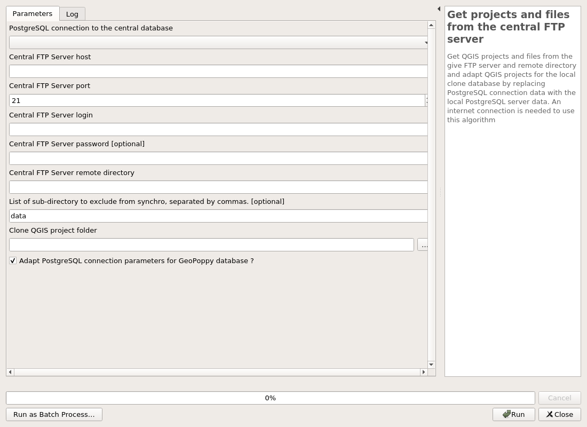
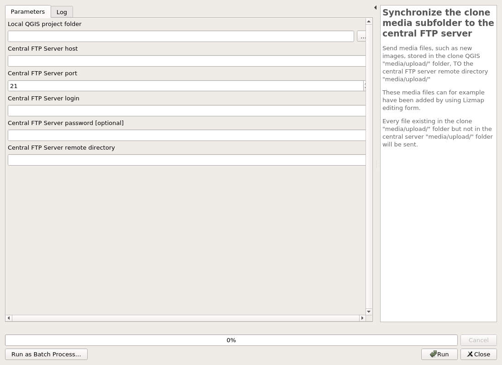

---
Title: Lizsync
Favicon: ../icon.png
...

[TOC]

# Lizsync

## 01 Installation

### Install Lizsync tools on the central database

 Install the LizSync schema with tables and function on the central database.

 This script will add
 * An audit schema with auditing functions and tables
 * A lizsync schema with tables and functions

Beware ! If the schema lizsync or audit already exists in the database, not installation will be made. You will need to manually correct the situation (drop or modifiy the schemas, tables and functions.

#### Parameters

| ID | Description | Type | Info | Required | Advanced |
|:-:|:-:|:-:|:-:|:-:|:-:|
CONNECTION_NAME|PostgreSQL connection to the central database|String||✓||
OVERRIDE_AUDIT|Drop audit schema and all data ?|Boolean||✓||
OVERRIDE_LIZSYNC|Drop lizsync schema and all data ?|Boolean||✓||

#### Outputs

| ID | Description | Type | Info |
|:-:|:-:|:-:|:-:|
OUTPUT_STATUS|Output status|Number||
OUTPUT_STRING|Output message|String||

***

### Prepare the central database

 Prepare the central server PostgreSQL database with the needed data for LizSync tool.

 LizSync needs to have :
 * A server ID stored in the lizsync.server_metadata table
 * All tables from the given schema must have a unique identifier column (uid) with standard uuid inside
 * All tables from the given schema must be audited (trigger of the audit tool)

 You can pass a list of PostgreSQL central database schemas and this alg will add the necessary data and tools

#### Parameters

| ID | Description | Type | Info | Required | Advanced |
|:-:|:-:|:-:|:-:|:-:|:-:|
CONNECTION_NAME_CENTRAL|PostgreSQL connection to the central database|String||✓||
ADD_SERVER_ID|Add server id in metadata table|Boolean||✓||
ADD_UID_COLUMNS|Add unique identifiers in all tables|Boolean||✓||
ADD_AUDIT_TRIGGERS|Add audit triggers in all tables|Boolean||✓||
SCHEMAS|Restrict to comma separated schema names. NB: schemas public, lizsync & audit are never processed|String||||

#### Outputs

| ID | Description | Type | Info |
|:-:|:-:|:-:|:-:|
OUTPUT_STATUS|Output status|Number||
OUTPUT_STRING|Output message|String||

***

### Upgrade LizSync tools in the central database

 Upgrade the Lizsync tables and functions in the central database.

 If you have upgraded your QGIS LizSync plugin, you can run this script to upgrade your central database to the new plugin version.

#### Parameters

| ID | Description | Type | Info | Required | Advanced |
|:-:|:-:|:-:|:-:|:-:|:-:|
CONNECTION_NAME|PostgreSQL connection to the central database|String||✓||
RUNIT|Check this box to upgrade. No action will be done otherwise|Boolean||✓||

#### Outputs

| ID | Description | Type | Info |
|:-:|:-:|:-:|:-:|
OUTPUT_STATUS|Output status|Number||
OUTPUT_STRING|Output message|String||

***

## 02 PostgreSQL synchronization

### Deploy a database package to the clone

 Deploy a ZIP archive, previously saved with the "Package central database" algorithm, to the chosen clone. This ZIP archive, named by default "central_database_package.zip" contains data from the central PostgreSQL database.

#### Parameters

| ID | Description | Type | Info | Required | Advanced |
|:-:|:-:|:-:|:-:|:-:|:-:|
CONNECTION_NAME_CENTRAL|PostgreSQL connection to the central database|String||✓||
CONNECTION_NAME_CLONE|PostgreSQL connection to the clone database|String||✓||
POSTGRESQL_BINARY_PATH|PostgreSQL binary path|File||✓||
ZIP_FILE|Database ZIP archive path|File||||

#### Outputs

| ID | Description | Type | Info |
|:-:|:-:|:-:|:-:|
OUTPUT_STATUS|Output status|Number||
OUTPUT_STRING|Output message|String||

***

### Create a package from the central database

 Package data from the central database, for future deployement on one or several clone(s).

 This script backups all data from the given list of schemas to a ZIP archive, named by default "central_database_package.zip".

 You can add an optionnal SQL file to run in the clone after the deployment of the archive. This file must contain valid PostgreSQL queries and can be used to drop some triggers in the clone or remove some constraints. For example "DELETE FROM pg_trigger WHERE tgname = 'name_of_trigger';"

 An internet connection is needed because a synchronization item must be written to the central database "lizsync.history" table during the process. and obviously data must be downloaded from the central database

#### Parameters

| ID | Description | Type | Info | Required | Advanced |
|:-:|:-:|:-:|:-:|:-:|:-:|
CONNECTION_NAME_CENTRAL|PostgreSQL connection to the central database|String||✓||
POSTGRESQL_BINARY_PATH|PostgreSQL binary path|File||✓||
SCHEMAS|List of schemas to package, separated by commas. (schemas public, lizsync & audit are never processed)|String||✓||
ADDITIONAL_SQL_FILE|Additionnal SQL file to run in the clone after the ZIP deployement|File||||
ZIP_FILE|Output archive file (ZIP)|FileDestination||✓||

#### Outputs

| ID | Description | Type | Info |
|:-:|:-:|:-:|:-:|
ZIP_FILE|Output archive file (ZIP)|File||
OUTPUT_STATUS|Output status|Number||
OUTPUT_STRING|Output message|String||

***

### Two-way database synchronization

 This scripts run a two-way data synchronization between the central and clone database.

 The data to synchronize are listed by reading the content of the "audit.logged_actions" of each database, since the last synchronization or the last deployement of ZIP package.

 This audit data are transformed into INSERT/UPDATE/DELETE SQL queries which are played in the databases in this order:
 1/ From the CENTRAL to the CLONE database
 2/ From the CLONE to the CENTRAL database

The central database stores which clone has replayed which audited modification, and keeps an history of synchronization items.

#### Parameters

| ID | Description | Type | Info | Required | Advanced |
|:-:|:-:|:-:|:-:|:-:|:-:|
CONNECTION_NAME_CENTRAL|PostgreSQL connection to the central database|String||✓||
CONNECTION_NAME_CLONE|PostgreSQL connection to the clone database|String||✓||

#### Outputs

| ID | Description | Type | Info |
|:-:|:-:|:-:|:-:|
OUTPUT_STATUS|Output status|Number||
OUTPUT_STRING|Output message|String||

***

## 03 GeoPoppy file synchronization

### Get projects and files from the central FTP server

 Get QGIS projects and files from the give FTP server and remote directory and adapt QGIS projects for the local clone database by replacing PostgreSQL connection data with the local PostgreSQL server data. An internet connection is needed to use this algorithm

#### Parameters

| ID | Description | Type | Info | Required | Advanced |
|:-:|:-:|:-:|:-:|:-:|:-:|
CONNECTION_NAME_CENTRAL|PostgreSQL connection to the central database|String||✓||
CENTRAL_FTP_HOST|Central FTP Server host|String||✓||
CENTRAL_FTP_PORT|Central FTP Server port|Number||✓||
CENTRAL_FTP_LOGIN|Central FTP Server login|String||✓||
CENTRAL_FTP_PASSWORD|Central FTP Server password|String||||
CENTRAL_FTP_REMOTE_DIR|Central FTP Server remote directory|String||✓||
FTP_EXCLUDE_REMOTE_SUBDIRS|List of sub-directory to exclude from synchro, separated by commas.|String||||
CLONE_QGIS_PROJECT_FOLDER|Clone QGIS project folder|File||✓||
REPLACE_DATASOURCE_IN_QGIS_PROJECT|Adapt PostgreSQL connection parameters for GeoPoppy database ?|Boolean||✓||

#### Outputs

| ID | Description | Type | Info |
|:-:|:-:|:-:|:-:|
OUTPUT_STATUS|Output status|Number||
OUTPUT_STRING|Output message|String||

***

### Send local QGIS projects and files to the clone FTP server

 Send QGIS projects and files to the clone FTP server remote directory.

 This script can be used by the geomatician in charge of the deployment of data to one or several clone(s).

 It synchronizes the files from the given local QGIS project folder to the clone remote folder by using the given FTP connexion. This means all the files from the clone folder will be overwritten by the files from the local QGIS project folder.

 Beware ! This script does not adapt projects for the clone database (no modification of the PostgreSQL connexion data inside the QGIS project files) !

#### Parameters

| ID | Description | Type | Info | Required | Advanced |
|:-:|:-:|:-:|:-:|:-:|:-:|
CONNECTION_NAME_CENTRAL|PostgreSQL connection to the central database|String||✓||
LOCAL_QGIS_PROJECT_FOLDER|Local desktop QGIS project folder|File||✓||
CLONE_FTP_HOST|Clone FTP Server host|String||✓||
CLONE_FTP_PORT|Clone FTP Server port|Number||✓||
CLONE_FTP_LOGIN|Clone FTP Server login|String||✓||
CLONE_FTP_PASSWORD|Clone FTP Server password|String||||
CLONE_FTP_REMOTE_DIR|Clone FTP Server remote directory|String||✓||
FTP_EXCLUDE_REMOTE_SUBDIRS|List of sub-directory to exclude from synchro, separated by commas.|String||||

#### Outputs

| ID | Description | Type | Info |
|:-:|:-:|:-:|:-:|
OUTPUT_STATUS|Output status|Number||
OUTPUT_STRING|Output message|String||

***

### Synchronize the clone media subfolder to the central FTP server

 Send media files, such as new images, stored in the clone QGIS "media/upload/" folder, TO the central FTP server remote directory "media/upload/"

 These media files can for example have been added by using Lizmap editing form.

 Every file existing in the clone "media/upload/" folder but not in the central server "media/upload/" folder will be sent.

#### Parameters

| ID | Description | Type | Info | Required | Advanced |
|:-:|:-:|:-:|:-:|:-:|:-:|
LOCAL_QGIS_PROJECT_FOLDER|Local QGIS project folder|File||✓||
CENTRAL_FTP_HOST|Central FTP Server host|String||✓||
CENTRAL_FTP_PORT|Central FTP Server port|Number||✓||
CENTRAL_FTP_LOGIN|Central FTP Server login|String||✓||
CENTRAL_FTP_PASSWORD|Central FTP Server password|String||||
CENTRAL_FTP_REMOTE_DIR|Central FTP Server remote directory|String||✓||

#### Outputs

| ID | Description | Type | Info |
|:-:|:-:|:-:|:-:|
OUTPUT_STATUS|Output status|Number||
OUTPUT_STRING|Output message|String||

***

