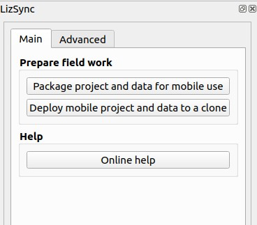
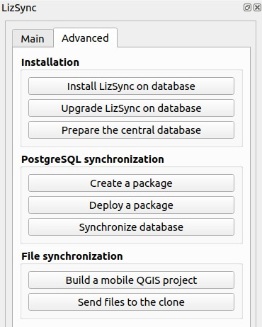

# User guide

## Architecture and workflow

A **PostgreSQL** database called *central database* contains data in **tables**, organised in **schemas**. No data is stored in the `public` schema.

LizSync tools must be installed in this central database with the [dedicated QGIS processing algorithm](../processing/#install-lizsync-tools-on-the-central-database). This will create a new schema `lizsync` in the central database, containing the needed tables and functions in charge of the synchronisation.

Then, you need to [prepare this database](../processing/#prepare-the-central-database) to add the needed metadata (server id in the table `lizsync.server_metadata`) and optionally prepare some tables for the synchronisation: add a unique id `uid` colums (UUID) and a trigger in charge of logging the table data modifications (insert, update, delete).

When the central database is ready, you can then [create a package from the central database ](../processing/#create-a-package-from-the-central-database). To do so, just open or save a QGIS project containing PostgreSQL layers from the central database, choose the layers to export, and the zip package file path. This action is considered as a full synchronisation. The output zip archive contains the data from the chosen layers, but also the needed information about the central server and the tables which have been exported.

This zip archive can be [deployed to one or many clone PostgreSQL databases](../processing/#deploy-a-database-package-to-the-clone). This action will completely **remove the tables** corresponding to the exported layers, and replace their content with the one inside the archive. It also **re-installs the LizSync tools** in the clone database, which will delete all previous audited data. After this step, the data of the synchronised tables in the clone(s) database will be the same as the one exported at the time of the package creation.

Data of the central and clone(s) database tables can then evolve freely, as soon as the tables structure is not modified (no addition or removal of tables or fields). For example, you can go to the field with QField installed in your tablet (or QGIS in your laptop) and edit data inside the clone database.

You can then **run a bidirectional synchronisation** with the [dedicated QGIS processing algorithm](#two-way-database-synchronization) by choosing the PostgreSQL connections for the central database and the clone database. You can also run a synchronisation by running the SQL query `SELECT lizsync.synchronize()` from a PostgreSQL connection to the clone database. The synchronisation is **a two-step action**, which first gets the data modification from the central server and then pushes the data modifications the clone to the central database.

## Technical considerations

Bidirectional synchronisation in LizSync is tied to some requirements:

* the history of synchronisation, data modification changes and other needed information are **stored inside the central database** `lizsync` schema.
* the data of the schemas `public` and `lizsync` are **never synchronised**.
* the tables to synchronise must have a **uid** field of type **uuid** with a automatic uuid as its default value. This field is the **pivot of the synchronisation process**, since it **identifies each object**. The same object in reality will share the same **uid** value across databases. Example of a UUID value for this field: `5d3d503c-6d97-f11e-a2a4-5db030060f6d`.
* the tables to synchronise must have an **auto increment primary key of the type integer**. This id column will contain unique values in each database, but **will not reliably identify the same object across databases**. This means the same object could have a different auto-increment id in the central and the clone(s) databases. This id must still exists, as many applications need it to perform well, such as QGIS.
* The **foreign key constraints** must be based on the **uid** field of the parent table, not on the auto-increment id field, since the id columns **can differ between databases** for the same object.
* During the **bidirectional synchronisation**,
    - insertions and deletions are **first applied from the central server to the clone**, and then **pushed from the clone to the central database**. This method has an impact for some scenarios. For example, if an object has been updated by the central database and deleted in a clone database, the update won't matter because at the end the object will be deleted.
    - For updates, the modifications are applied **only for the modified columns** in the synchronised tables, which prevents conflicts from happening to often.
    - When the **same object has been modified for the same column**, conflicts are automatically handled: **the last update wins** (the one with the more recent modification timestamp).

## Prepare the field work in QGIS

LizSync proposes two algorithms which helps to create a portable version of a QGIS project and then send the created files (modified project, LizSync zip archive and the exported Geopackage) to the clone via FTP or SFTP:

Basically, before going to the field, you need to:

* **package the data from your central database** only for the PostgreSQL layers to edit, and then **deploy the ZIP archive** created to the clone database of your portable device (Android smartphone or laptop)
* create a **mobile version of your QGIS project** which you can use with no internet connection inside you clone (Android device, laptop with QGIS):
    - change the datasource of the PostgreSQL layers to target the clone database
    - export the other vector layers to a Geopackage file and adapt their datasource to target this new file
* **send the project and all related files** to the clone

Two all-in-one algorithms allows to perform all the needed steps:

* [Package project and data from the central server](../processing/#package-project-and-data-from-the-central-server)
* [Deploy project and data to a clone](../processing/#deploy-project-and-data-to-a-clone)

## Plugin dock menu

A QGIS menu allows to quickly access the Processing algorithms proposed by the LizSync plugin:

* The "Main" tab allows to run the two principal all-in-one algorithms
    
* The "Advanced" tab allows to run the other algorithms
    
